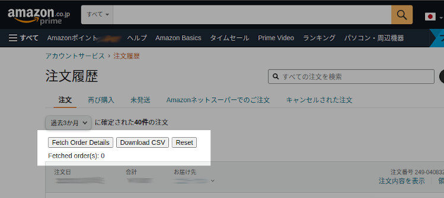
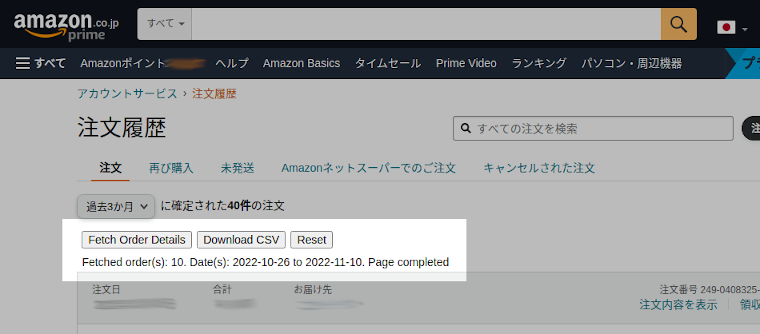

Amazon Japan Order History Downloader
==========

Browser extension to export / download order history as CSV from [Amazon Japan](https://amazon.co.jp).

- Fetch item details for all orders displayed on the current page
- Fetch can be done (manually) across multiple pages, and download as one consolidated file
- Export file is in pipe-delimited format, with below fields:
  - Order ID
  - Order Date
  - Item name (if item quantity is more than 1, then quantity is added as a suffix, e.g. " x2" for 2)
  - Price (if item quantity is more than 1, then this is the total amount, i.e. quantity x unit price)
- Export file items are sorted by order date. 

Supported browsers: Firefox, Google Chrome

Background
-----
I keep itemised record of family spending. We spend a fair amount on Amazon Japan (we live in Japan), but I found there is currently no way to download the order history in a structured format. As of 2022, [Amazon US](https://amazon.com) has a Order History Report feature, but strangely it is not available on [Amazon Japan](https://amazon.co.jp). So, I wrote this simple browser extension to fulfill my need.

There is a related extension [アマゾン注文履歴フィルタ](https://github.com/furyutei/amzOrderHistoryFilter) (Amazon Order History Filter, in Japanese only), which is also able to download order history. But it is more geared towards business use, supporting some complex features like "download all order receipts for the whole year". I just need something simple for my use case, thus I wrote my own instead - it is a single js script of less than 500 lines, without any library dependency. 

Installation
-----
- Firefox: Go to about:debugging#/runtime/this-firefox, click "Load Temporary Add-on"
- Google Chrome: Go to chrome://extensions, turn on Developer mode, and click "Load unpacked"

Usage
-----
1. On the order history page, if the extension is installed correctly, some additional buttons should be displayed above the order summary list, as follow:

2. Click "Fetch Order Details" button, it will start fetching details of each order on the **current** page.
3. While it is fetching, the status text below the buttons will automatically update, showing the number of orders fetched, and the min and max dates of the orders.
4. When it completes fetching all orders on the current page, the status will display "Page completed", as follow:

5. Click on the "Download CSV" button, to download the fetched details as file.

Note - the fetched details are kept as long as you keep the the current browser tab opened. The typical use case would be - open another history page, fetch order details, and so on for several pages, and when you fetched up to the desired date, then finally click download as one consolidated file.